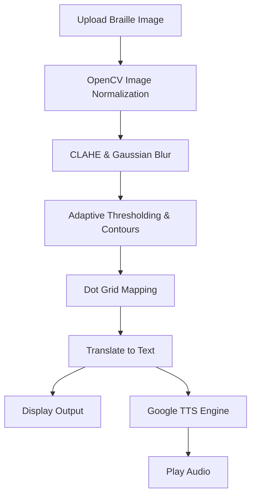

# 👁️‍🗨️ AI Braille Translator: Empowering Accessibility


> An enterprise-grade Optical Braille Recognition (OBR) system that uses advanced computer vision to translate tactile Braille paper images into readable text and audible speech (TTS).

<div align="center">
  
</div>

## 📌 The Impact
Reading physical Braille requires tactile knowledge. Sighted educators, parents of visually impaired children, or digital archivers often struggle to read physical Braille documents. This tool bridges the gap by instantly translating physical Braille into text and audio.

## ✨ Premium Enterprise Features
- **Live Camera Integration:** Instantly scan physical Braille documents using your laptop or mobile webcam (`st.camera_input`).
- **Multilingual NLP Translation:** Translates decoded Braille into English, Bengali (বাংলা), Spanish, French, and Hindi using Deep-Translator.
- **Multilingual Text-to-Speech (TTS):** Integrated `gTTS` engine reads the translated text aloud in your chosen language—a crucial feature for true accessibility.
- **Data Analytics Dashboard:** Built-in Plotly graphs to track scanning history, dot counts, and language metrics across sessions.
- **CLAHE Vision Engine:** Handles badly lit, shadowed, or blurry images using Contrast Limited Adaptive Histogram Equalization with Auto-Scaling for high-res mobile photos.
- **Smart Contour Mapping:** High-precision bounding boxes generated dynamically around detected Braille dots.

## 🧠 System Architecture



## 🚀 Installation & Run

1. **Clone the repository:**
   ```bash
   git clone https://github.com/almuzahidseyam/AI-Braille-Translator.git
   cd AI-Braille-Translator
   ```

2. **Create virtual environment:**
   ```bash
   python -m venv venv
   source venv/bin/activate
   ```

3. **Install dependencies:**
   ```bash
   pip install -r requirements.txt
   ```

4. **Launch the App:**
   ```bash
   streamlit run app.py
   ```

## 🛠️ Tech Stack
- **Vision:** OpenCV (`cv2`), Numpy
- **Audio:** `gTTS` (Google Text-to-Speech)
- **UI:** Streamlit, Custom CSS

## 🤝 Contributing
Feel free to open issues and pull requests to improve the dot-mapping structural logic!

## 📝 License
MIT License.
